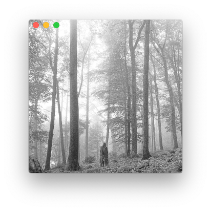

# cmus-swift
Album art and remote controls for [cmus](https://github.com/cmus/cmus/) on macOS, written in Swift & with [SwiftUI](https://developer.apple.com/xcode/swiftui/)



## Features
- album art display using AVFoundation, folder searching, and metaflac
- familiar bindings for `cmus-remote` control
  - **c** - play/pause
  - **b** - next
  - **z** - previous
  - **.** - seek +1:00
  - **l** - seek +0:05
  - **,** - seek -1:00
  - **h** - seek -0:05

## Installation and Usage
``` bash
git clone https://github.com/Coreball/cmus-swift.git
cd cmus-swift
open -a Xcode cmus-swift.xcodeproj
```
To create an app archive from within Xcode, go to Product > Archive and then Distribute App > Copy App.
Export it to a location of your choosing, and optionally copy cmus-swift.app into /Applications.
